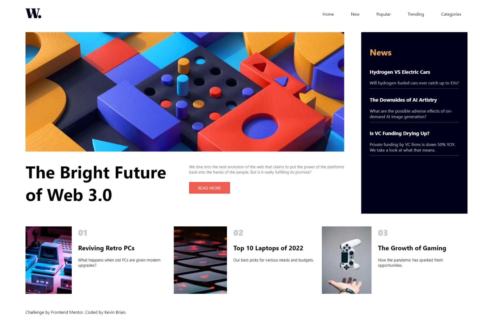
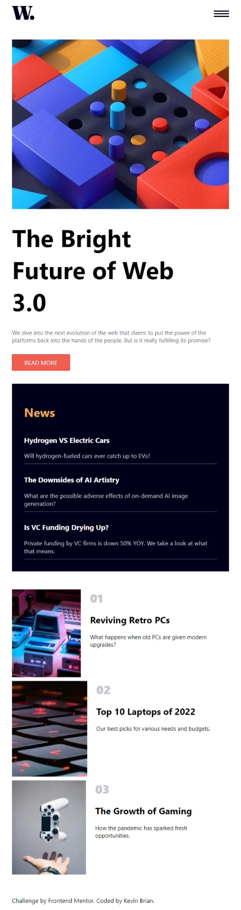

# Frontend Mentor - News homepage solution

This is a solution to the [News homepage challenge on Frontend Mentor](https://www.frontendmentor.io/challenges/news-homepage-H6SWTa1MFl). Frontend Mentor challenges help you improve your coding skills by building realistic projects. 

## Table of contents

- [Overview](#overview)
  - [The challenge](#the-challenge)
  - [Screenshot](#screenshot)
  - [Links](#links)
- [My process](#my-process)
  - [Built with](#built-with)
  - [What I learned](#what-i-learned)
  - [Continued development](#continued-development)
  - [Useful resources](#useful-resources)
- [Author](#author)
- [Acknowledgments](#acknowledgments)

## Overview

### The challenge

Users should be able to:

- View the optimal layout for the interface depending on their device's screen size
- See hover and focus states for all interactive elements on the page
- **Bonus**: Toggle the mobile menu (requires some JavaScript)

### Screenshot

### Links

- Solution URL: [https://github.com/realkevinbrian/newshomepage](https://github.com/realkevinbrian/newshomepage)
- Live Site URL: [https://newshomepage.vercel.app/](https://newshomepage.vercel.app)

## My process

### Built with

- Semantic HTML5 markup
- CSS custom properties
- Flexbox
- CSS Grid
- Mobile-first workflow
- [Next.js](https://nextjs.org/) - React framework

### What I learned

This is my first experience using NextJS, I learned how to build smart and optimized web apps using NextJS one of the most used React Framework

### Continued development

I will continue to develop and improve this web app, to make user that the experience in consistent and mobile friendly.

### Useful resources

- [NetNinja NextJS crash course](https://www.youtube.com/watch?v=A63UxsQsEbU&list=PL4cUxeGkcC9g9gP2onazU5-2M-AzA8eBw) - This channel helped to grasp how nextjs work, this is amazing channel for those who want to learn about web development.

## Author

- Website - [realkevinbrian](https://realkevinbrian.netlify.app)
- Frontend Mentor - [@realkevinbrian](https://www.frontendmentor.io/profile/realkevinbrian)
- Twitter - [@realkevinbrian](https://www.twitter.com/realKevinBrian)
